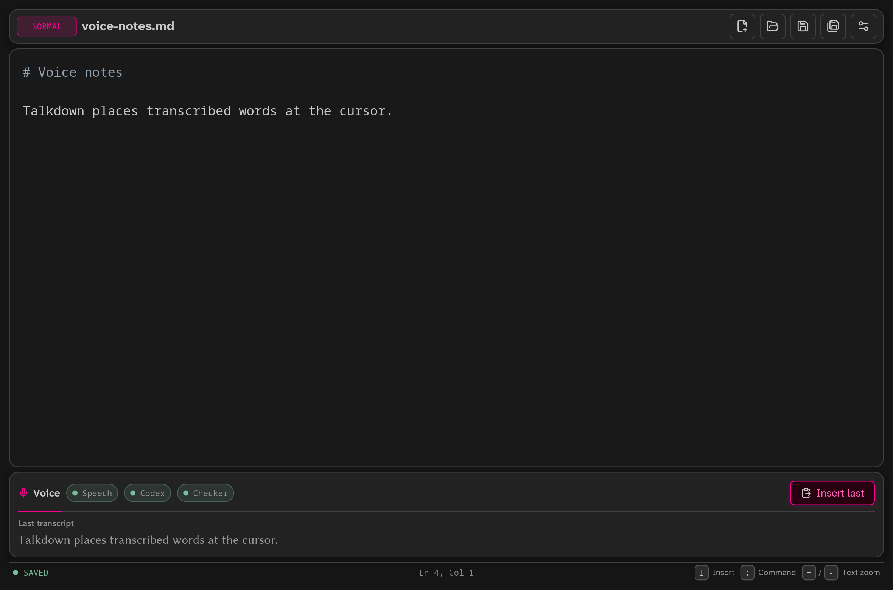

<div align="center">
  
  <h1>Talkdown</h1>
  <p><strong>A cursor-first text editor for writing and editing with your voice.</strong></p>
</div>

Talkdown treats speech like another input method. Put the cursor where you want
to write, hold <kbd>Space</kbd>, speak, and release. Your words appear in the
document at that exact spot.

You can also select some text—or simply place the cursor nearby—then hold
<kbd>c</kbd> and describe a change such as “make this more concise.” Talkdown
asks Codex for a small, targeted edit and validates it locally before changing
the document.

<p align="center">
  
</p>

> [!WARNING]
> Talkdown is an early-stage experiment and was built mostly with AI assistance.
> Expect rough edges, keep backups of important files, and see
> [Current limitations](#current-limitations) before relying on it for daily
> work.

## What can Talkdown do?

- **Dictate wherever the cursor is.** Hold <kbd>Space</kbd> to insert speech at
  the cursor or replace the current selection.
- **Edit by voice.** Hold <kbd>c</kbd> and ask for a contextual change near the
  cursor, such as rewriting a sentence or changing its tone.
- **Transcribe locally.** Speech recognition runs on your computer with
  Whisper, so ordinary dictation does not need a cloud speech service.
- **Clean up conservatively.** The default Harper checker can fix a small set
  of clear grammar issues and keeps a reviewable record of what it applied or
  ignored.
- **Work like a regular text editor.** Open and save files, type, paste, select,
  undo, redo, wrap long lines, and use syntax highlighting.
- **Keep typing separate from navigation.** Talkdown starts in a Vim-inspired
  Normal mode where accidental key presses cannot insert text. Insert mode
  behaves like a conventional editor.
- **Recover from failures.** If transcription or a contextual edit fails, the
  document is left alone and the latest usable transcript remains available
  through **Insert last**.
- **Adjust the workspace.** Settings cover text size, interface scale, word
  wrap, speech and Codex models, grammar checking, and reducing other audio
  while recording.

## Quick start

Talkdown is currently distributed as source code. The documented installation
path is best tested on Linux; macOS and Windows packaging still need polish.

### 1. Install the build requirements

You need:

- Rust 1.92 or newer;
- a C/C++ build toolchain, CMake, libclang, and native audio development files;
- a working desktop session and microphone for dictation.

On Debian or Ubuntu:

```sh
sudo apt install build-essential cmake clang libclang-dev libasound2-dev pkg-config
```

Install Rust through [rustup](https://rustup.rs/) if it is not already
available.

### 2. Build and run

From the repository:

```sh
cargo run --release
```

To open a file immediately:

```sh
cargo run --release -- path/to/notes.md
```

The first release build can take a while because it compiles Whisper and the
rest of the desktop application.

### 3. Enable dictation

Open **Settings** with <kbd>Ctrl</kbd>/<kbd>Cmd</kbd>+<kbd>,</kbd>, choose the
default speech model, and select **Download**. Talkdown verifies the model
before installing it. Apply the setting when the download finishes.

You can instead choose an existing whisper.cpp GGML `.bin` model. The default
is the English `base.en` model; larger English models such as `small.en` may be
more accurate on capable hardware.

### 4. Enable contextual commands

Voice and typed contextual commands use the installed
[Codex CLI](https://developers.openai.com/codex/cli/) with ChatGPT sign-in:

```sh
codex login
codex login status
```

You need a ChatGPT account with access to Codex. Talkdown’s supported Codex
path does not use an OpenAI Platform API key. This step is optional if you only
want local dictation and ordinary editing.

### Optional: install a Linux desktop launcher

```sh
./scripts/install.sh
```

This builds Talkdown and installs the application, desktop entry, and icon
under `~/.local`. You can then launch it from your desktop’s application menu.

Tagged GitHub releases provide an unsigned x86_64 Linux archive containing the
default CPU Whisper build, desktop entry, and icon. Linux is currently the only
automated binary release target; macOS and Windows packaging still need
platform testing.

The CPU speech backend is enabled by default. If your system supports one of
the accelerated Whisper backends, pass it to the installer:

```sh
./scripts/install.sh --features whisper-vulkan
./scripts/install.sh --features whisper-cuda
```

## How to use Talkdown

Talkdown opens in **Normal mode**. You can move the cursor and select text, but
printable keys act as commands instead of changing the document.

### Dictate text

1. Move the cursor to the insertion point, or select text to replace.
2. Hold <kbd>Space</kbd> and speak.
3. Release <kbd>Space</kbd> to finish.

The live transcription appears in the voice panel. Once final transcription
finishes, Talkdown inserts the raw words immediately and runs the selected
checker. The complete dictation remains a single undo step.

### Make a contextual edit

1. Select the text you want to change, or place the cursor close to it.
2. Hold <kbd>c</kbd>.
3. Say something like “turn this into a heading” or “make this sentence
   friendlier.”
4. Release <kbd>c</kbd>.

Talkdown gives Codex only a bounded portion of the document and asks for a
specific target and replacement. It applies the result only if the target can
still be found safely and unambiguously.

No microphone? Press <kbd>:</kbd>, type the same kind of instruction, and press
<kbd>Enter</kbd>.

### Type normally

Press <kbd>i</kbd> to enter **Insert mode** at the cursor. Press
<kbd>Esc</kbd> when you want to return to Normal mode.

## Essential controls

| Input | What it does |
| --- | --- |
| Hold <kbd>Space</kbd> | Dictate at the cursor or replace the selection |
| Hold <kbd>c</kbd> | Give a contextual voice command |
| <kbd>:</kbd> | Type a contextual command |
| <kbd>i</kbd> / <kbd>a</kbd> | Enter Insert mode before / after the cursor |
| <kbd>Enter</kbd> | Insert a newline at the cursor and enter Insert mode |
| <kbd>o</kbd> / <kbd>Shift</kbd>+<kbd>o</kbd> | Open a line below / above and start typing |
| <kbd>Esc</kbd> | Cancel speech or return to Normal mode |
| <kbd>u</kbd> | Undo |
| <kbd>x</kbd> | Delete the selection or next character |
| <kbd>Ctrl</kbd>/<kbd>Cmd</kbd>+<kbd>S</kbd> | Save |
| <kbd>Ctrl</kbd>/<kbd>Cmd</kbd>+<kbd>Shift</kbd>+<kbd>S</kbd> | Save as |
| <kbd>Ctrl</kbd>/<kbd>Cmd</kbd>+<kbd>O</kbd> | Open a file |
| <kbd>Ctrl</kbd>/<kbd>Cmd</kbd>+<kbd>,</kbd> | Open Settings |

Arrow keys, Home, End, Page Up, Page Down, and Shift-selection work normally.
Normal mode also supports:

| Input | What it does |
| --- | --- |
| <kbd>h</kbd> <kbd>j</kbd> <kbd>k</kbd> <kbd>l</kbd> | Move left, down, up, right |
| <kbd>b</kbd> / <kbd>w</kbd> | Move backward / forward by word |
| <kbd>0</kbd> / <kbd>$</kbd> | Move to the start / end of the line |
| <kbd>g</kbd> / <kbd>Shift</kbd>+<kbd>g</kbd> | Move to the start / end of the document |
| <kbd>+</kbd> / <kbd>-</kbd> | Change editor text size |
| <kbd>Ctrl</kbd>/<kbd>Cmd</kbd>+<kbd>+</kbd> / <kbd>-</kbd> | Scale the complete interface |

The physical <kbd>Insert</kbd> key also enters Insert mode. <kbd>Delete</kbd>
and <kbd>Backspace</kbd> delete once and then enter Insert mode, which makes
small corrections quick without leaving Normal mode silently editable.

## Your text and privacy

Talkdown keeps the editor buffer, cursor, selection, undo history, and file
writes under local control.

- Whisper transcription runs locally after a speech model is installed.
- The default Harper grammar check also runs locally.
- Contextual commands, and optional Codex-based dictation cleanup, send a
  limited window of nearby text to Codex through the signed-in Codex CLI.
- Codex does not receive direct control of the editor or filesystem. It returns
  a small proposed replacement that Talkdown validates and applies locally.
- If a service is unavailable or a response is stale or ambiguous, Talkdown
  preserves the document and keeps the raw transcript when possible.
- Talkdown does not read or copy `~/.codex/auth.json`; authentication remains
  owned by the Codex CLI.

Local transcription can work without a network connection once the model is
installed. Contextual commands require Codex and a network connection.

## Current limitations

- Talkdown is an early runnable preview, not yet a polished daily-driver
  release.
- Linux has the most complete build and desktop-install instructions. Native
  audio, dialogs, and packaging still need broader macOS and Windows testing.
- Speech uses the system’s default microphone; there is no device picker yet.
- Dictation is push-to-talk and each utterance is currently limited to 30
  seconds.
- The default speech model is English. Other whisper.cpp models and language
  codes can be selected manually, but the first-run flow is English-focused.
- Contextual commands require a ChatGPT-authenticated Codex installation.
- The intended Atkinson Hyperlegible Next and Libertinus Sans fonts are not
  bundled, so the interface may use fallback fonts on your system.
- Search, crash recovery, multiple open buffers, and automatic endpoint
  detection are not implemented yet.

See the [roadmap](docs/roadmap.md) for planned work.

## Advanced configuration

Most options are available in Settings. These environment variables are useful
for custom setups:

| Variable | Purpose | Default |
| --- | --- | --- |
| `TALKDOWN_WHISPER_MODEL` | Use a specific whisper.cpp GGML model at launch | Saved selection, then the downloaded default |
| `TALKDOWN_WHISPER_LANGUAGE` | Set a Whisper language code, or `auto` | `en` |
| `TALKDOWN_WHISPER_THREADS` | Set the number of decoder threads | Available CPUs minus 2, capped at 8 |
| `TALKDOWN_CODEX_BIN` | Use a different Codex CLI executable | `codex` |

For detailed build instructions, accelerated backends, integration tests, and
troubleshooting, see the [development guide](docs/development.md).

## Project documentation

- [Development guide](docs/development.md) — building, testing, models, and
  troubleshooting
- [Architecture](docs/architecture.md) — how the editor, speech, checking, and
  Codex boundaries fit together
- [Roadmap](docs/roadmap.md) — current gaps and planned milestones
- [Agent guidance](AGENTS.md) — safety and workflow requirements for
  contributors and coding agents
